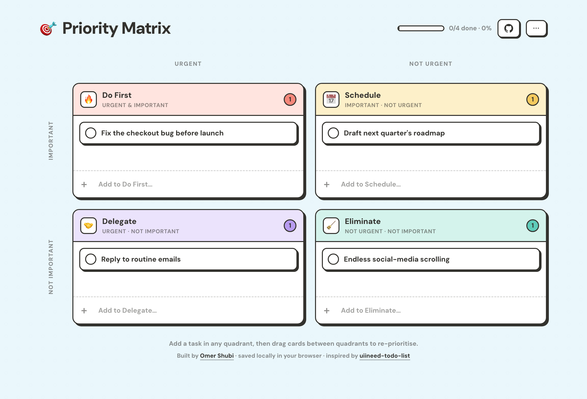

# 🎯 Priority Matrix

A minimalist to-do list that organises tasks by the **[Eisenhower method](https://en.wikipedia.org/wiki/Time_management#The_Eisenhower_method)** — every task is sorted by **importance** and **urgency** into a 2×2 matrix, so you always know what to do first.

**[▶ Live demo](https://omershubi.github.io/priority-matrix/)**

No account, no server, no build step — a single self-contained HTML file. Your data is saved locally in your browser.

## The matrix

|                   | Urgent            | Not urgent          |
| ----------------- | ----------------- | ------------------- |
| **Important**     | 🔥 **Do First**   | 📅 **Schedule**     |
| **Not important** | 🤝 **Delegate**   | 🧹 **Eliminate**    |

## Features

- **Add tasks inline** — every quadrant has its own input, so tasks land straight where they belong.
- **Drag & drop** tasks between quadrants to re-prioritise — changes are saved automatically.
- Mark done / undo, **double-click to edit**, and delete — with a satisfying flatten-on-hover.
- A live completion bar in the header tracks your progress at a glance.
- A compact **⋯ menu** for hide/show completed, clear completed, reset, and JSON **export / import** (imports append to your list).
- Fully responsive — the 2×2 grid stacks into a single column on mobile.
- Everything is stored in `localStorage`; nothing ever leaves your browser.

## Usage

Just open [`index.html`](index.html) in any modern browser — or visit the [live demo](https://omershubi.github.io/priority-matrix/).

Press <kbd>Enter</kbd> to add a task, double-click a task to edit it, and drag cards between quadrants to change their priority.

## Tech

Vanilla HTML, CSS, and JavaScript in one file. No frameworks, no dependencies, no build tooling. The only external resource is the [DM Sans](https://fonts.google.com/specimen/DM+Sans) web font (it falls back gracefully to a system font offline).

## Credits

Built by [Omer Shubi](https://omershubi.github.io/).

The visual design and some CSS — the dotted background, the neo-brutalist card shadows, and the flatten-on-hover interaction — are adapted from the lovely [uiineed-todo-list](https://github.com/ricocc/uiineed-todo-list) by [ricocc](https://github.com/ricocc) (MIT licensed), reimagined around the Eisenhower matrix. Their copyright notice is preserved in [THIRD_PARTY_NOTICES.md](THIRD_PARTY_NOTICES.md).

## License

This project is [MIT](LICENSE) © 2026 Omer Shubi. It incorporates MIT-licensed material from uiineed-todo-list (© 2025 Ricocc); see [THIRD_PARTY_NOTICES.md](THIRD_PARTY_NOTICES.md).
